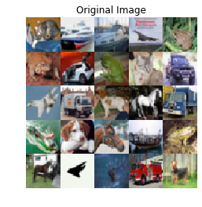
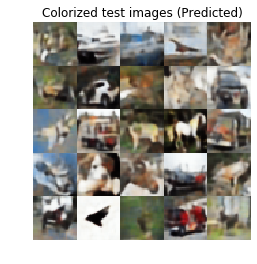

[](https://www.python.org/)

[](https://www.python.org/downloads/release/python-360/) 

# Automatic_colourization-Autoencoders-
 
 We all must have black and white images from old times and must have thought that how the scene would look at that time as we do not see any colours. No worries this progam does this for you, all you need to do is feed in the sketch as the input and get back the coloured image and there you go now you can imagine how things were in 1950's.
  
  This is an autoencoder based project which takes in the balck and white image as the input and returns the coloured image. The main advantage of using autoencoders is that one can get only the important features of a particular image which is called the "Latent Vector" which means that it eliminates the noise from the image and if we have only the Latent Vector can reconstruct the entire image from it with almost no loss as compared to the original image. Moreover the size of the latent vector is very small compared to the original image.

## Dependencies
```bash
numpy
matplotlib
cv2
os
keras
```

We use the cifar10 dataset for this program. Since I could not find any dataset which has black and white images as the input data and the corresponding coloured image as the output data, so I manually created the input dataset by converting the images to black and white and the corresponding original images as output images.






## Author
[](https://www.linkedin.com/in/shobhit-tulshain-a7562916b/)

* [**Shobhit Tulshain**](https://github.com/Shobhit2000)
